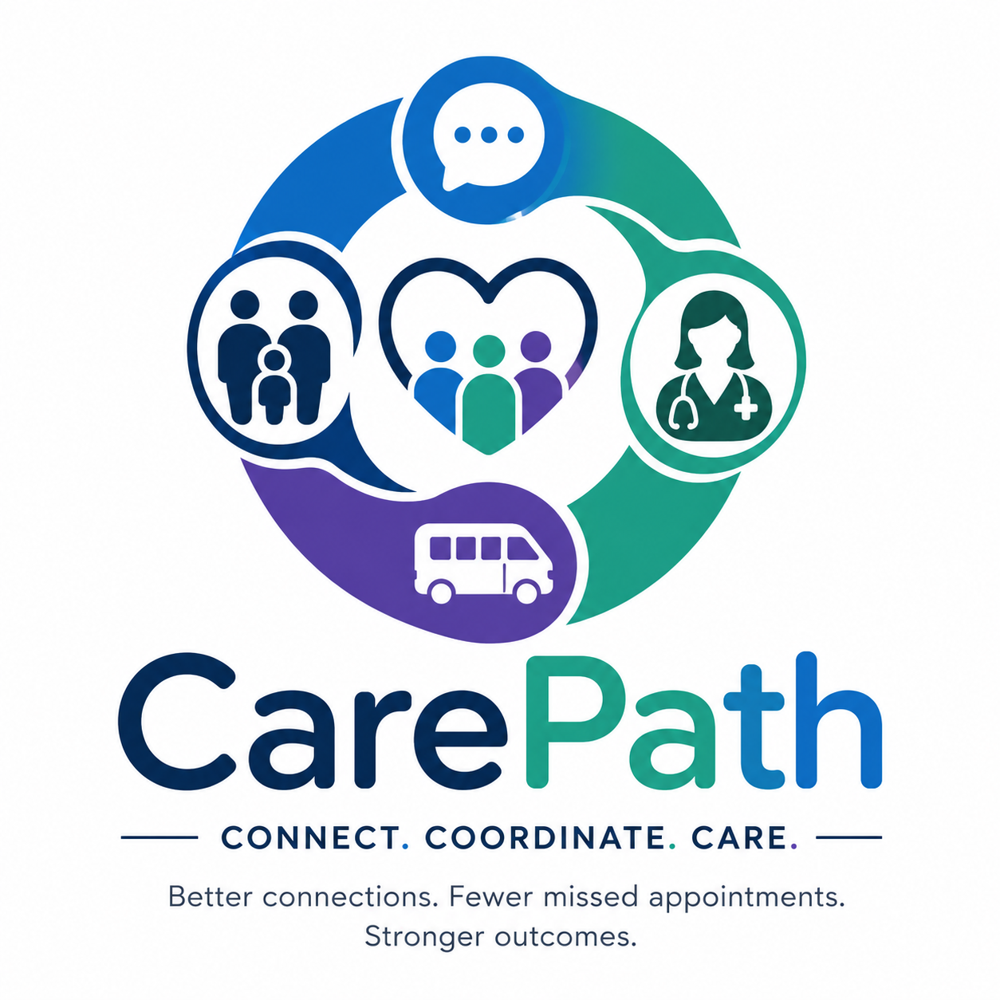

# CarePath



## About

CarePath is a transportation coordination tool that helps patients arrange reliable rides to medical appointments, aiming to reduce no-shows and improve access to essential healthcare.

CarePath is designed to be location-agnostic and does not rely on mileage as a decision factor.

The project is focused on removing transportation and communication failures that cause missed care. It is being shaped through early validation conversations with patients, caregivers, and transportation stakeholders.

## Quick Start

### Prerequisites

- [Node.js 18+](https://nodejs.org)
- [PostgreSQL](https://postgresql.org) (local or remote)
- npm (included with Node.js)

### Installation

```bash
git clone https://github.com/Debalent/CarePath.git
cd CarePath
npm run setup
```

The setup script will:

1. Check Node.js and npm versions
2. Create `.env` from `.env.example`
3. Prompt for your `DATABASE_URL`, `JWT_SECRET`, and optional Twilio credentials
4. Install API and UI dependencies
5. Generate the Prisma client and run database migrations
6. Print startup instructions

### Starting the app

```bash
# Start both API and UI together
npm run dev:all

# Or start separately
npm run dev                        # API → http://localhost:3001
cd carepath-ui && npm run dev      # UI  → http://localhost:3000
```

### Reconfigure environment

```bash
npm run setup:reconfigure
```

### Prisma Studio (browse the database)

```bash
npm run prisma:studio
```

---

## Validation Workspace (Early Discovery)

This repository includes a lightweight validation pre-pack used to capture founder interviews and prepare evidence for investor and cohort updates.

### Location

- `docs/validation/README.md`
- `docs/validation/conversation-tracker.csv`
- `docs/validation/signal-rubric.md`
- `docs/validation/synthesis-template.md`
- `docs/validation/synthesis-log.md`
- `docs/validation/case-studies/`

### Current Case Study Sequence

1. Case Study #1: Kevin (Transportation Driver)
2. Case Study #2: Churchie (Dialysis Patient)
3. Case Study #3: Alyssa (Heart and Asthma Patient)
4. Case Study #4: Katina (RN, Arkansas Baptist Hospital)
5. Case Study #5: Elijah (Registered Nurse BSN)
6. Case Study #6: Monica (CNA / Home Health Caregiver)
7. Case Study #7: Michelle (Parent Caregiver, Medicaid Wheelchair Transportation)
8. Case Study #8: Kevin Lee (Healthcare Transportation Specialist and Veteran Advocate)

### How To Use

1. Add one row per conversation in `docs/validation/conversation-tracker.csv`.
2. Score each conversation with `docs/validation/signal-rubric.md`.
3. Update synthesis notes in `docs/validation/synthesis-log.md` after each interview.
4. Build the Donna Harris submission pack after at least 10 interviews with segment diversity and repeated patterns.
